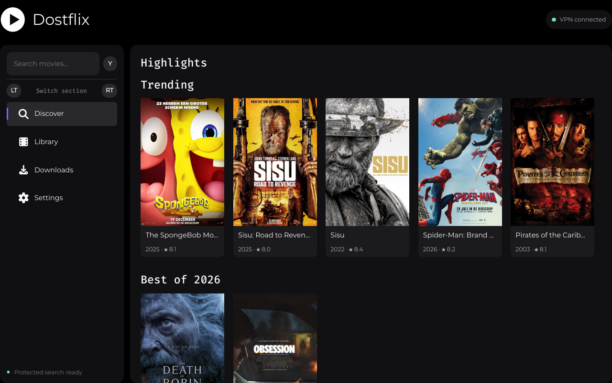
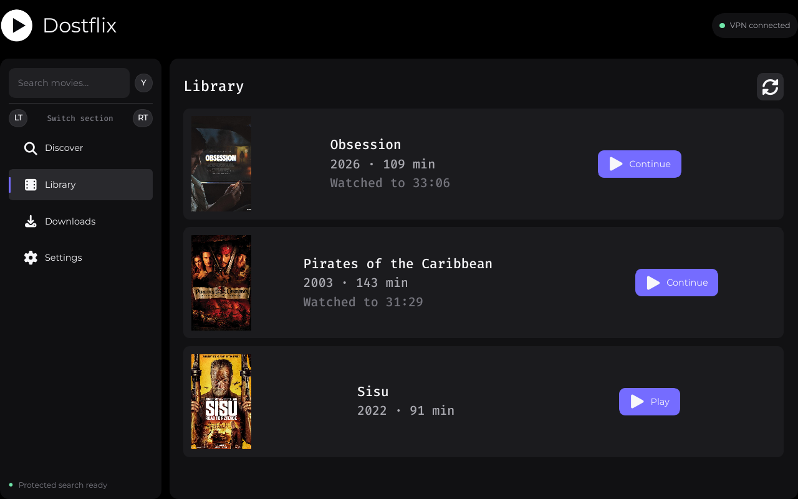

<p align="center"></p>
<h1 align="center">Dostflix</h1>
<p align="center">Native Linux movie discovery, VPN-protected torrent streaming and an offline library.<br>Built with Qt Quick, TorrServer and libmpv — designed for desktop and Steam/Gamescope.</p>



## What it does

- Activates your selected OpenVPN profile at startup and disconnects only the connection it started.
- Keeps Dostflix, Prowlarr and TorrServer inside a process-scoped nftables kill switch.
- Searches your own Prowlarr/Torznab providers and streams one selected torrent at a time.
- Starts playback after a safe buffer while retaining the movie as a resumable download.
- Stores metadata, posters, watch progress and downloaded subtitles for offline playback.
- Supports mouse, keyboard and SDL-compatible controllers, including Steam Input and Steam Controller.
- Scales automatically in Gamescope and offers fit, fill/crop and native fullscreen playback.

> Dostflix contains no indexers or media. Configure only sources and download content you are legally allowed to use.

## Install on Arch Linux

The package declares all application dependencies. Prowlarr and TorrServer are expected from an AUR helper or a configured binary repository.

```bash
git clone https://github.com/sandordost/Dostflix.git
cd Dostflix/packaging/arch
makepkg -si
```

Launch **Dostflix** from the application menu. On first use:

1. Import an `.ovpn` profile in **Settings**.
2. Add a TMDB Read Access Token for Highlights and library metadata.
3. Open managed Prowlarr and enable the indexers you want to search.
4. Optionally add OpenSubtitles credentials and preferred languages.
5. Enter a movie title and press Enter. Select a result to buffer, play and retain it.



## Other distributions

Arch is the supported V1 target. On another system, install equivalent development/runtime packages for:

| Component | Debian/Ubuntu family | Fedora family |
|---|---|---|
| Qt 6 | `qt6-base-dev`, `qt6-declarative-dev`, Qt SVG/Wayland tools | `qt6-qtbase-devel`, `qt6-qtdeclarative-devel`, Qt SVG/Wayland |
| Player/input | `libmpv-dev`, SDL 3 development files | `mpv-libs-devel`, SDL 3 development files |
| VPN/security | NetworkManager, `network-manager-openvpn`, OpenVPN, nftables, Polkit | NetworkManager, `NetworkManager-openvpn`, OpenVPN, nftables, Polkit |
| Desktop/data | libsecret, SQLite, Montserrat, Font Awesome | libsecret, SQLite, Montserrat, Font Awesome |
| Services | Install Prowlarr and TorrServer from their upstream packages | Install Prowlarr and TorrServer from their upstream packages |

Package names and SDL 3 availability vary by release. Once dependencies are installed:

```bash
cmake -S . -B build -G Ninja -DCMAKE_BUILD_TYPE=Release \
  -DCMAKE_INSTALL_PREFIX=/usr
cmake --build build
ctest --test-dir build --output-on-failure
sudo cmake --install build
```

The Polkit policy and network helper are installed with the app. NetworkManager must be the active network service.

## Controls

- **Enter** searches; an empty search shows Trending, Best of the current year and High Ratings.
- **Esc / B / Circle** leaves a dialog or returns to the active movie.
- **LT/RT** changes sections; during playback the triggers seek.
- **X / Square** switches result layout and opens subtitles in the player.
- **Y / Triangle** opens search and toggles fullscreen in the player.
- Player controls include subtitle selection/delay, mute/volume and Fill Screen.

## Development

```bash
cmake -S . -B build -G Ninja -DCMAKE_BUILD_TYPE=Debug
cmake --build build -j2
ctest --test-dir build --output-on-failure
cmake --build build --target dostflix_ui_qmllint
```

Do not launch the production executable during automated tests: startup intentionally changes VPN/firewall state. Tests use isolated loopback fakes. Start with the [V1 handoff](docs/V1-HANDOFF.md) and the [product design](docs/superpowers/specs/2026-08-31-dostflix-design.md) before changing cross-component behavior.

## Projects and APIs

[Qt](https://www.qt.io/) · [mpv](https://mpv.io/) · [SDL](https://www.libsdl.org/) · [NetworkManager OpenVPN](https://networkmanager.dev/docs/vpn/) · [nftables](https://www.netfilter.org/projects/nftables/) · [Prowlarr](https://prowlarr.com/) · [TorrServer](https://github.com/YouROK/TorrServer) · [TMDB API](https://developer.themoviedb.org/docs/getting-started) · [OpenSubtitles API](https://opensubtitles.stoplight.io/) · [Dostify reference](https://github.com/sandordost/Dostify)

This product uses the TMDB API but is not endorsed or certified by TMDB.
